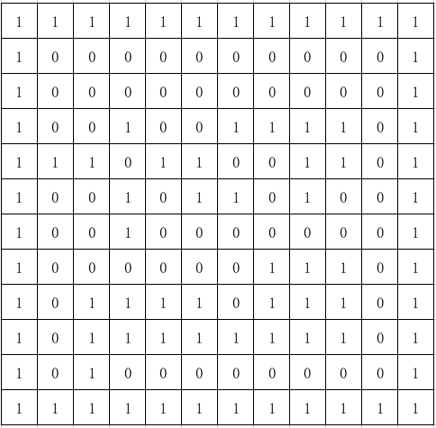
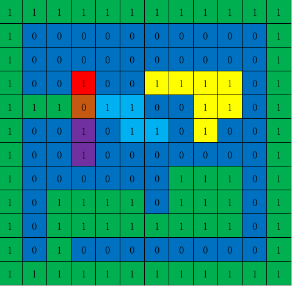

有如下矩阵

随机选择任意一个方格，找出与当前方格内数字纵向和横向数字相同的单元格

比如选择第1排第1列(从0开始)的方格数字是0。那么应该找出标记为**蓝色**的方格

**评估标准：** 
1. 执行结果正确(必要条件)
2. 执行效率最高(优先考虑)
3. 空间复杂度最低

**测试数据：** com.tanikawa.java.algorithm.flood_fill.TestData::testData

**单测类：**  FloodFillTest.searchRectPointTest